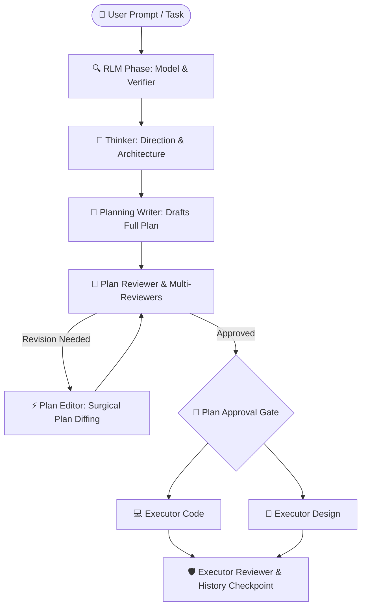

# 🐎 Kuda IDE

> **Next-Generation AI-Native Desktop IDE with Hierarchical Swarm Architecture & RLM Repository Intelligence.**

Built on **Tauri v2**, **Rust**, and **React 18 + TypeScript**, Kuda IDE is an enterprise-grade, agentic software engineering environment designed for complex codebase modifications, multi-pass auditing, and surgical code generation.

---

## 🌟 Core Architecture & Swarm Pipeline

Kuda IDE replaces monolithic LLM chat with a specialized **10-Role Multi-Agent Swarm** that divides engineering tasks into isolated, highly efficient phases:



### 1. RLM Phase (Sublinear Context Research)
* **RLM Model**: Explores large codebases using localized Python sandboxes (`rlm_python`), symbol maps (`code_outline`), and ripgrep without loading raw files into the main prompt context.
* **RLM Verifier**: Audits research completeness and validates safety boundaries before the Thinker begins design.

### 2. Strategic Planning & Surgical Revision
* **Thinker**: Formulates high-level architectural decisions and task contracts.
* **Planning Writer**: Expands the approved direction into exhaustive task breakdowns inside `.kuda/plan/plan.md`.
* **Plan Reviewer & Reviewers**: Multi-pass auditing for logic flaws, race conditions, and missing edge cases.
* **Plan Editor**: A dedicated, cost-efficient role that applies precision surgical edits (`multi_replace_file`) to `.kuda/plan/plan.md` during review rounds without wasting expensive reasoning tokens.

### 3. Dual-Track Execution & Verification
* **Executor Code**: Executes backend, systems, and algorithms with atomic file checkpoints.
* **Executor Design**: Dedicated frontend/UI agent specialized in CSS, responsive layouts, and visual hierarchy.
* **Executor Reviewer**: Asserts diff integrity, runs automated unit tests, and verifies acceptance criteria.

---

## 🛡️ Security & Real-Time Workspace

* **Deterministic Security Boundary**: Absolute path canonicalization guards against directory traversal attacks outside the project workspace.
* **Live File Synchronizer**: Real-time bidirectional synchronization between Rust `notify` file watcher and Monaco Editor tabs.
* **Multi-Replace Tolerance**: Zero-range and exact byte-for-byte replacement chunking to ensure zero-loss surgical edits.

---

## 🚀 Quick Start (Local Development)

### Prerequisites
* **Node.js**: v20.x or newer
* **Rust**: `1.78+` with `cargo` and `rustup`
* **OS Dependencies (Linux only)**: `libwebkit2gtk-4.1-dev`, `build-essential`, `libssl-dev`

### Installation & Run
```bash
# 1. Clone the repository
git clone https://github.com/tukang-ai/kuda-ide.git
cd kuda-ide

# 2. Install frontend dependencies
npm install

# 3. Launch in development mode
npm run tauri dev
```

---

## 📄 License

This project is licensed under the **GNU General Public License v3.0 (GPL-3.0)** — see the [LICENSE](LICENSE) file for details.
